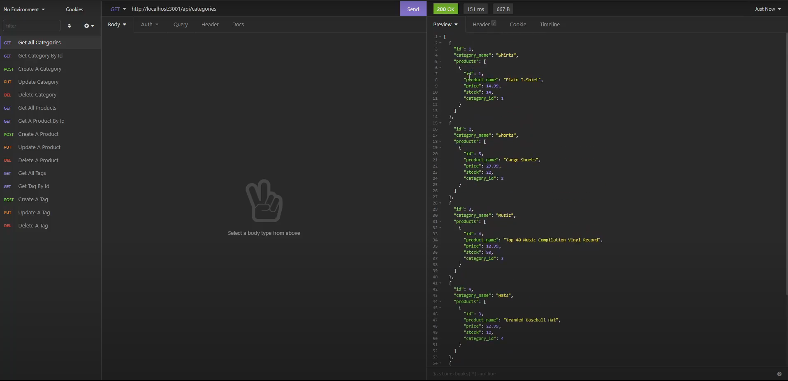

# Ecommerce Backend Build 

## Description
This is an application where the backend for an ecommerce site is built out. It needed to have the routes and the models built on top of the code that was given at the start. The used technologies include node.js, sequelize, and express.js. [The video can be viewed here.](https://drive.google.com/file/d/1beKSGuocXN-P2LI4rAq0vVeebEJyq45h/view?usp=sharing)

## Table of Contents
* [Installation](#installation)
* [Usage](#usage)
* [License](#license)
* [Contribution](#contribution)
* [Tests](#tests)
* [Questions](#questions)

## Installation 
The application can be installed by cloning the repository. The user will then need to initialize a MySQL server using the provided schema then seed the application by running `npm run seed` in the root folder. After that the user will need to open the root folder and start it with NodeJs after running `npm i`.

## Usage 
The application can be used by connecting to the api routes in a web browser or a program like insomnia. The api's are accessible under `/api/categories`, `/api/products`, and `/api/tags`.

## License 
Copyright zachary-berdell-elliott

Permission is hereby granted, free of charge, to any person obtaining a copy of this software and associated documentation files (the “Software”), to deal in the Software without restriction, including without limitation the rights to use, copy, modify, merge, publish, distribute, sublicense, and/or sell copies of the Software, and to permit persons to whom the Software is furnished to do so, subject to the following conditions:

  The above copyright notice and this permission notice shall be included in all copies or substantial portions of the Software.
    
  THE SOFTWARE IS PROVIDED “AS IS”, WITHOUT WARRANTY OF ANY KIND, EXPRESS OR IMPLIED, INCLUDING BUT NOT LIMITED TO THE WARRANTIES OF MERCHANTABILITY, FITNESS FOR A PARTICULAR PURPOSE AND NONINFRINGEMENT. IN NO EVENT SHALL THE AUTHORS OR COPYRIGHT HOLDERS BE LIABLE FOR ANY CLAIM, DAMAGES OR OTHER LIABILITY, WHETHER IN AN ACTION OF CONTRACT, TORT OR OTHERWISE, ARISING FROM, OUT OF OR IN CONNECTION WITH THE SOFTWARE OR THE USE OR OTHER DEALINGS IN THE SOFTWARE.

## Contribution 
Someone can contribute to the application by reporting any issues to me.

## Tests 
The application can be tested by installing it then running all the api routes.

## Questions 
FAQ: 

One question that gets asked is how do you make the requests in insomnia. This can be done by clicking the plus sign to create a new request then performing them like demonstrated in the walkthrough video.

If you have any additional questions, please contact me at zacharyberdell@gmail.com to receive an answer to your question. If you would like to view other projects by me then [visit my profile here.](https://github.com/zachary-berdell-elliott)
